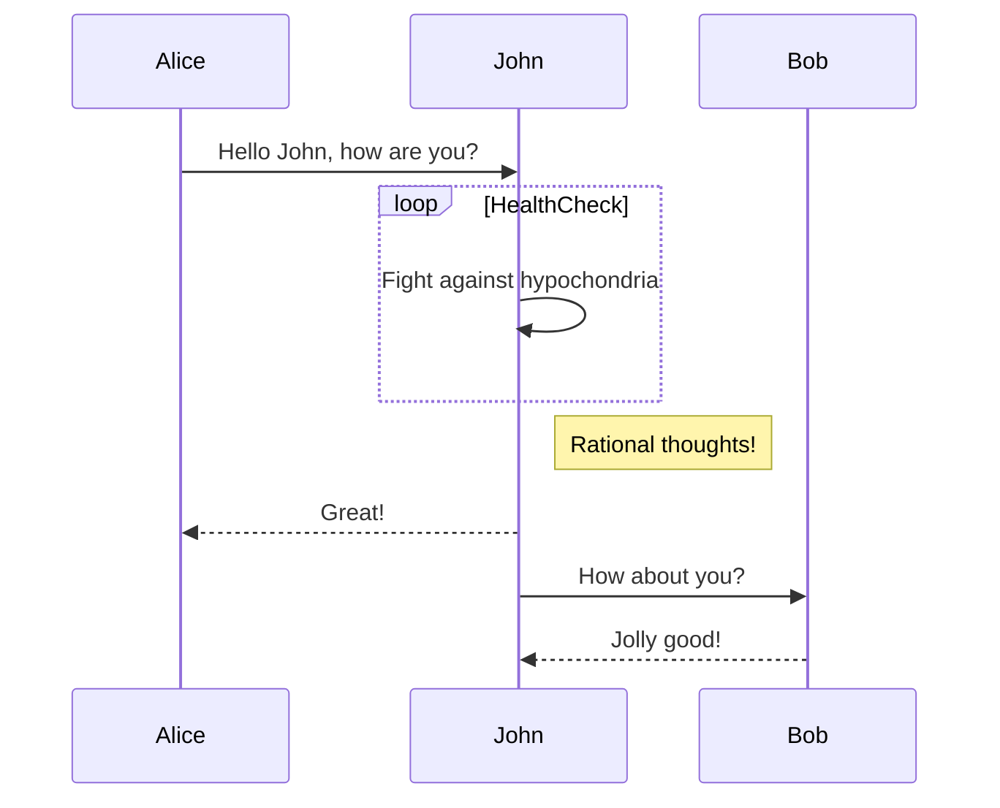
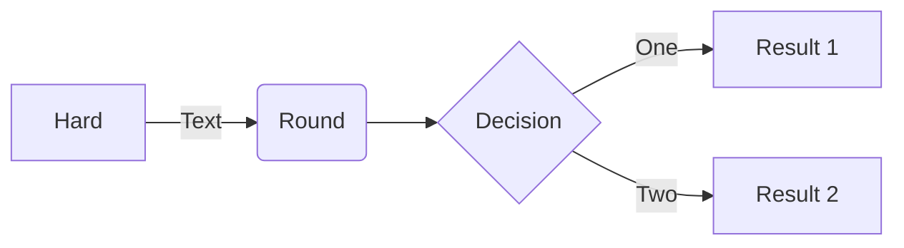

# UML

## Sequence



```mermaid
sequenceDiagram
    actor Consumer
    participant API
    database DB
    Consumer->>api: { email, password }
    API-->>DB: { email }
    DB-->>API: { user: { id, email, name, hash } }
    API-->>API: check hash
    API-->>Consumer: { user: { id, email, name } }
```
```mermaid
sequenceDiagram
    actor A as Alice
    database J as John
    A->>J: Hello John, how are you?
    J->>A: Great!
```
## Flowchart


