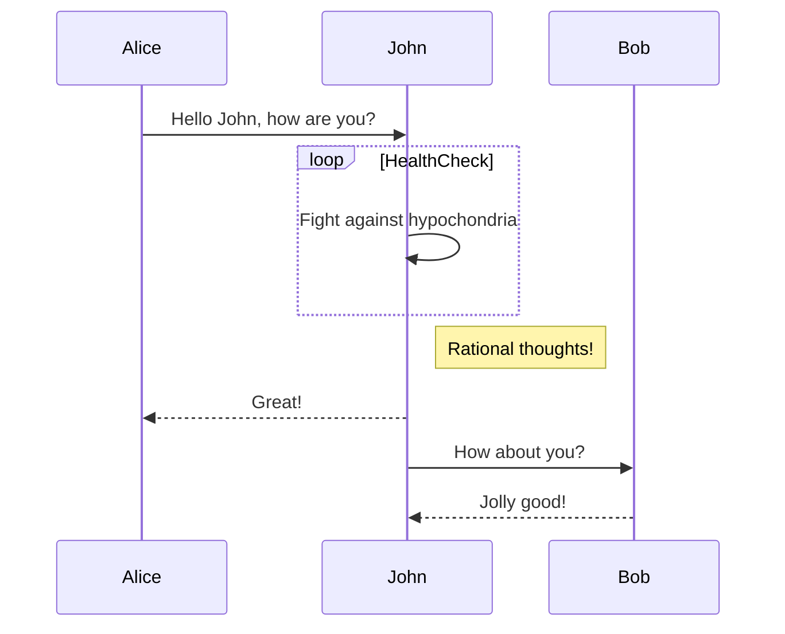
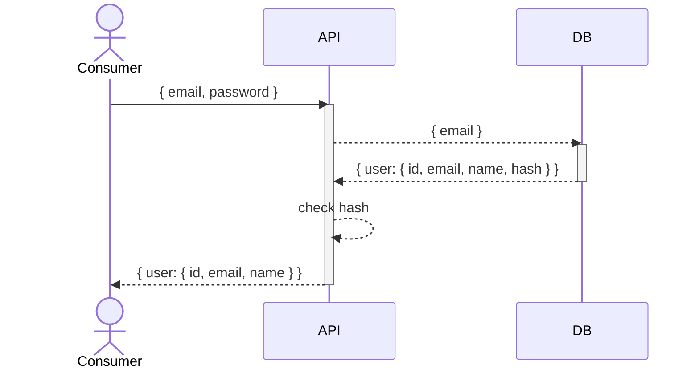
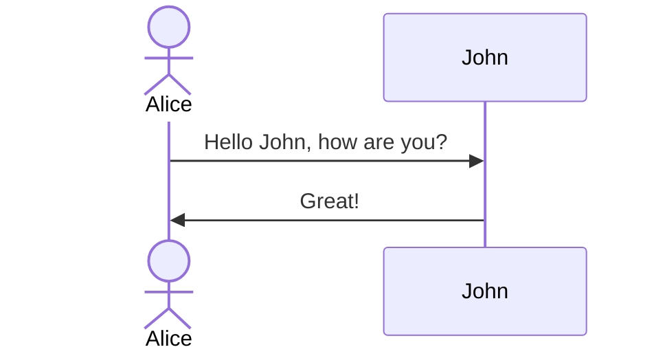
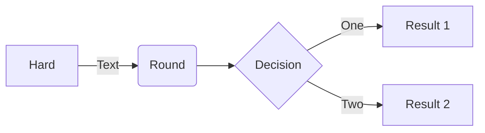

# UML

## Sequence

```mermaid
sequenceDiagram
    Alice->>John: Hello John, how are you?
    loop HealthCheck
        John->>John: Fight against hypochondria
    end
    Note right of John: Rational thoughts!
    John-->>Alice: Great!
    John->>Bob: How about you?
    Bob-->>John: Jolly good!
```

```mermaid
sequenceDiagram
    actor Consumer
    participant API
    participant DB
    Consumer->>API: { email, password }
    activate API
    API-->>DB: { email }
    activate DB
    DB-->>API: { user: { id, email, name, hash } }
    deactivate DB
    API-->>API: check hash
    API-->>Consumer: { user: { id, email, name } }
    deactivate API
```

```mermaid
sequenceDiagram
    actor A as Alice
    participant J as John
    A->>J: Hello John, how are you?
    J->>A: Great!
```
## Flowchart

```mermaid
flowchart LR

A[Hard] -->|Text| B(Round)
B --> C{Decision}
C -->|One| D[Result 1]
C -->|Two| E[Result 2]
```
