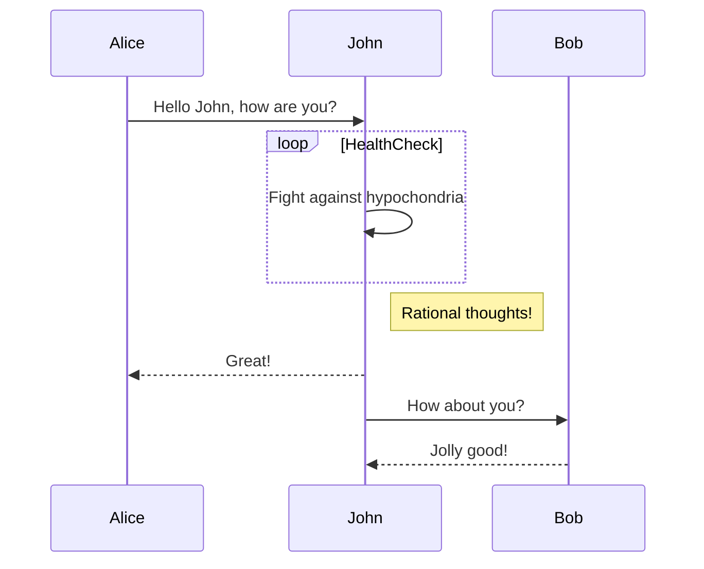
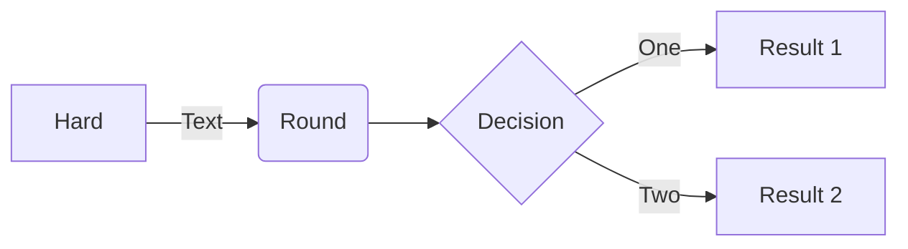

# UML

## Sequence



```mermaid
sequenceDiagram
income->>api: { email, password }
api-->>db; { email }
db-->>api; { user: { id, email, name, hash } }
api-->>api: check hash
api-->>income: { user: { id, email, name } }
```

## flowchart


